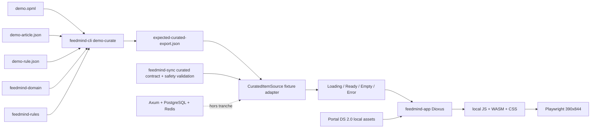
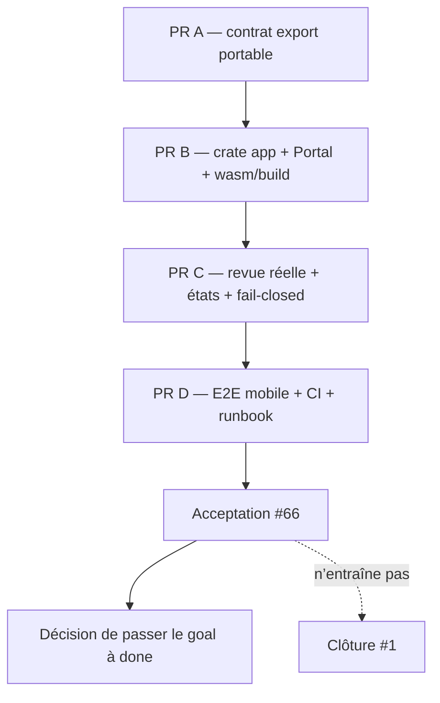

# Plan canonique v1 — première verticale produit Dioxus

| Champ | Valeur |
| --- | --- |
| Identifiant | `feed-radar.dioxus-product-proof.v1` |
| Version | `1.0.0` |
| Date | 2026-07-12 |
| Statut | verticale locale fusionnée par #69 ; extension live-sync locale prouvée le 2026-07-13 ; `phase_4.dioxus-product-proof` done après preuves locales ; promotion publique toujours bloquée par revue humaine et absence de runtime interactif |
| Epic | [#1](https://github.com/libre-ai/feed-radar/issues/1) |
| Issue d’implémentation unique | [#66](https://github.com/libre-ai/feed-radar/issues/66) |
| Jalon goals | `phase_4.dioxus-product-proof`, `done` après preuve complète fusionnée |

## Décision en une phrase

La première verticale est une **revue locale d’un article curaté et de sa décision explicable** : une surface Dioxus web/WASM affiche le `CuratedItemExport` v0.1 réellement régénéré par le pipeline Rust déterministe OPML + article normalisé + règle/evidence, à travers un port de lecture typé et un adapter fixture explicitement local.

Ce n’est ni un dashboard, ni un jeu de cartes mockées, ni une promesse de runtime serveur. La preuve déterministe doit fonctionner sans PostgreSQL, Redis, secret, auth ou réseau métier.

## Extension bornée après la v1

L’[ADR 0007](../adr/0007-bounded-public-feed-sync.md) ajoute sans remplacer cette preuve déterministe une traversée locale réseau : OPML borné, hôtes HTTPS exacts, fetch/redirections contrôlés, règle explicite, état de rejeu hash-only, export validé puis bundle Dioxus statique. La CI conserve la fixture pour sa reproductibilité ; le réseau n’est exercé que par un script manuel daté. Cette extension ne crée ni import navigateur, ni API publique, ni promotion automatique de maturité.

## Pourquoi ce cadrage

Feed Radar est au niveau **Dojo** : les preuves CLI/API existent, mais le parcours produit complet, l’exploitation hébergée et l’UI ne sont pas mûrs. Une première UI branchée directement sur l’API ferait dépendre la preuve de l’auth, de PostgreSQL, de Redis, de routes encore couplées au SQL et d’un worker dont l’évaluation ne réutilise pas encore `feedmind-rules`. La tranche locale réduit cette surface de risque tout en montrant la valeur différenciante déjà prouvée : une information retenue pour une raison vérifiable.

La preuve autorise uniquement la formulation suivante : **verticale Dioxus web locale et déterministe**. Elle n’autorise pas les termes PWA supportée, offline, desktop, mobile natif, self-hosted prêt, multi-utilisateur prêt ou release candidate.

## Audit des parcours réellement disponibles

| Parcours | Fixture déterministe | Local sans DB | Runtime DB | Limite observée pour cette verticale |
| --- | --- | --- | --- | --- |
| OPML | `examples/demo.opml` ; parser testé | `opml-summary`, `demo-curate` | import/export CLI et `/api/v1/opml/*` | l’import API écrit en DB mais ne fetch pas ; inutile pour une première vue read-only |
| Ingestion / fetch | RSS/Atom inline dans les tests parser | `fetch-feed` et `demo-curate-live` avec réseau | création de feed API et worker `FetchFeed` | réseau non déterministe ; les URL utilisateur imposent un cadrage SSRF distinct |
| Normalisation | `demo-article.json` est un `Article` sérialisé ; samples parser | `FeedParser` produit `FeedItem`, puis `Article::from_feed_item` | API/worker écrivent directement leurs lignes SQL | pas de service de déduplication portable : le runtime s’appuie sur les contraintes DB |
| Règles / evidence | `demo-rule.json` + tests `feedmind-rules` | `evaluate-rule`, `demo-curate` | preview API et worker | le core produit `RuleDecision`/`DecisionEvidence`, mais le worker réimplémente la regex et persiste une forme plus pauvre |
| Curated export | golden `expected-curated-export.json` | génération, validation et diff via CLI | aucun endpoint dédié | le DTO et le builder sont privés dans `crates/cli`; ils doivent devenir un contrat Rust portable avant l’UI |
| API / storage | pas de fixture API produit complète | health seulement sans parcours produit | routes direct SQL avec tenant transaction ; API requiert DB, auth DB, Redis, JWT et master key | les traits `FeedStore`, `ArticleStore`, `RuleStore`, `EventStore`, `SnapshotStore` n’ont pas d’adapter produit générique consommable par l’UI |

### Trois niveaux à ne pas confondre

1. **Fixture** : les quatre fichiers `examples/` forment un scénario synthétique versionné. Le golden est produit par le code Rust et vérifié par diff en CI.
2. **Local sans DB** : OPML, parse/fetch, évaluation et export sont exécutables par la CLI ; seul le fetch live nécessite le réseau.
3. **Runtime DB** : API et worker utilisent PostgreSQL/Redis, tenant RLS et JWT local. Ce niveau n’expose pas encore un contrat de curated review cohérent avec `RuleDecision` et n’est donc pas la source de cette première tranche.

## Comparaison des verticales candidates

Notes de 1 (défavorable) à 5 (favorable). Pour l’effort, 5 signifie le plus petit effort sûr.

| Candidate | Valeur utilisateur | Réemploi contrats | Sécurité | Effort | Force de preuve | Total /25 | Verdict |
| --- | ---: | ---: | ---: | ---: | ---: | ---: | --- |
| A. Revue d’un item curaté + raison/evidence | 5 | 5 | 5 | 4 | 5 | **24** | retenue |
| B. Inbox feeds/articles alimentée par API DB | 4 | 3 | 2 | 2 | 3 | 14 | après stabilisation API/auth et tests runtime |
| C. Import OPML + fetch interactif | 4 | 4 | 2 | 1 | 2 | 13 | trop de mutation, réseau et sécurité pour la première preuve |

### Choix minimal

L’utilisateur ouvre `/app/`, lit le titre et le contexte source réels du golden, voit la décision `saved`, la règle décisive, son explication, son evidence hash et sa confiance, puis peut déplier la preuve au clavier. Il ne peut ni modifier, ni importer, ni fetcher, ni déclencher une exécution.

Le scénario est minimal mais vertical : génération domaine/règles → contrat export → port de lecture → projection Dioxus → preuve navigateur.

## Références lues et contraintes reprises

### Écosystème et dépôts de référence

- [ADR Feed Radar 0002](../adr/0002-rust-first-product-stack.md) : Dioxus durable, adapters minces, aucun secret/BYOK dans le frontend.
- [ADR ecosystem 0032](https://github.com/constantin-jais/constantin-jais/blob/main/ecosystem/specs/shared/adrs/0032-web-shell-dioxus-ratified.md) : Dioxus/dioxus-cli 0.7.9, tokens Portal, tests navigateur, budget WASM et logs sans PII.
- [Sessions PR #87](https://github.com/libre-ai/sessions/pull/87), fusionnée par `381553d` : crate app séparé, bundle `dx` vérifié, base path, états honnêtes, mobile 390×844, absence de stockage navigateur et de CDN.
- [Agent Factory PR #22](https://github.com/libre-ai/agent-factory/pull/22), fusionnée par `a3720bd` : logique durable dans le core Rust, gate wasm32, tokens hors navigateur, a11y mobile et native hors preuve.
- [Agent Factory PR #20](https://github.com/libre-ai/agent-factory/pull/20), fusionnée par `5fd77a7` : `cargo check -p <package> --target wasm32-unknown-unknown` est un hard gate, sans `continue-on-error`.
- [Client Kit à `d0d2299`](https://github.com/libre-ai/client-kit/tree/d0d22998f571a13802686099198514b9c063b885) : Portal Core expose locale, thème, navigation adaptative et touch target 44 px ; Portal UI reste renderer-thin et tokens-only ; le template Dioxus versionne localement les assets/manifest/provenance.

Les hashes des fichiers locaux consultés ont été comparés à `main` pour les trois PRs de référence ; ils sont identiques. Aucun dépôt externe n’est modifié par ce plan.

### Vérification Dioxus actuelle

La documentation actuelle a été vérifiée via Context7, bibliothèque officielle `/dioxuslabs/dioxus/v0.7.2`. Elle confirme pour la série 0.7 :

- `Router::<Route>` avec un enum `Routable`, et `base_path` dans `[web.app]` ;
- `dx build --release` pour l’artefact web ;
- `use_resource`/`Signal` avec états pending, success et error explicites ;
- copie des valeurs de signal avant un `await` pour éviter de conserver un borrow réactif ;
- cohérence du premier rendu en cas d’hydratation.

Le pin produit reste **0.7.9**, conformément à l’ADR ecosystem et à la preuve Sessions. Le plan ne prescrit aucune API supprimée (`Scope`, `cx`, `use_state`).

## Architecture de la verticale



### Frontière du crate app

- **Emplacement** : `surfaces/ui/`.
- **Package Cargo** : `feedmind-app`.
- **Cible de cette issue** : web `wasm32-unknown-unknown` uniquement.
- **Responsabilité** : routage d’une route, état de chargement, projection accessible, interaction de dévoilement de preuve et adaptation de source.
- **Interdit** : règles métier, regex, génération de hash métier, validation de confidentialité, SQL, Redis, auth, crypto, provider, fetch de feed et écriture persistante.

Une unique crate app évite de transformer la preuve en framework interne. Aucun crate `desktop`, `mobile`, `distro` ou serveur Dioxus n’est créé.

### Dépendances autorisées

Runtime Cargo du crate app :

- `dioxus = 0.7.9`, features web minimales et router seulement si nécessaire à la base `/app` ;
- `feedmind-sync` par path workspace, propriétaire du DTO export portable et de sa validation client-safe ;
- `portal-core` et `portal-ui` épinglés à l’immuable Client Kit `d0d22998f571a13802686099198514b9c063b885` ;
- `serde` / `serde_json` uniquement si le port fixture les requiert.

Dev/test :

- `dioxus-ssr = 0.7.9` pour les projections d’états ;
- Playwright épinglé dans `e2e/package-lock.json` pour le smoke navigateur.

Présentation : crates Portal réelles pour thème/a11y/i18n/navigation, plus distribution locale **Libre IA / Portal Design System 2.0** copiée avec `manifest.json`, `provenance.json` ou lock équivalent et contrôle de drift. Polices système ou fichiers locaux seulement. Le pin Client Kit est ajouté à l’allowlist git de `deny.toml`, sans wildcard ni branche mobile.

La faisabilité wasm32 du pin a été vérifiée avant ce plan avec un crate temporaire minimal important `PortalSurface`, `Theme` et `A11y` : `cargo check --target wasm32-unknown-unknown` passe avec Rust 1.97. Ce résultat ne remplace pas le hard gate produit et le coût UniFFI/Portal doit entrer dans la première mesure WASM.

Toute autre dépendance demande justification licence, maintenance, taille WASM et alternative rejetée. AGPL, SSPL, service SaaS obligatoire et branche git mobile sont refusés.

### Contrat et port

Le DTO public `feedmind_sync::curated::CuratedItemExport` reprend exactement le JSON v0.1 actuel. Son extraction hors de la CLI ne change ni le schema, ni les noms de champs, ni l’ordre golden.

Port logique read-only :

```text
CuratedItemSource::load()
  -> Future<Result<Option<CuratedItemExport>, CuratedItemLoadError>>
```

Pour v1, `FixtureCuratedItemSource` embarque le golden versionné à la compilation (`include_str!`) puis le désérialise par le contrat Rust ; il ne tente aucun accès filesystem depuis WASM. Son nom et la page indiquent « démonstration locale » ; il n’est jamais présenté comme une réponse API. Une future source HTTP pourra implémenter le même port après stabilisation, sans changer la projection.

Avant `Ready`, le contrat portable applique `validate_client_safe()` :

- format et origine attendus ;
- hash `sha256:` bien formés ;
- `purpose == local_export` pour cet adapter ;
- `privacy_classification` limitée à `public` ou `normal` ;
- `contains_raw_private_content`, `contains_secrets`, `contains_byok_material` et `allow_downstream_execution` tous faux ;
- raison, explication et références requises non vides.

Une violation retourne une erreur typée ; l’UI ne reçoit aucune projection partielle de l’item.

### État et erreurs

| État | Rendu attendu | Sémantique |
| --- | --- | --- |
| `Loading` | libellé Portal traduit | `role=status`, `aria-live=polite` |
| `Ready` | item, source, décision, raison et preuve | titres structurés, `<details>`/contrôle natif clavier |
| `Empty` | « aucun export local disponible » | état vide honnête, jamais une fausse inbox vide |
| `Error` | message stable sans payload brut + retry local | `role=alert`, focus déplacé/restauré vers l’erreur |

Les erreurs distinguent au minimum lecture, JSON invalide, version non supportée et contrainte de sécurité refusée. Elles ne rendent ni JSON brut, ni URL source brute si elle n’est pas déjà admise par le contrat, ni stack trace. Les logs utilisent seulement des identifiants/hash stables et un code d’erreur.

### Accessibilité et mobile

- viewport d’acceptation initial : 390×844 ; aucune largeur horizontale excédentaire ; safe areas prises en compte ;
- contrôles interactifs ≥ 44×44 CSS px conformément à Portal Core ;
- HTML sémantique, noms accessibles, ordre de titres, navigation et focus visibles ;
- interaction clavier complète, focus déterministe après erreur/retry ;
- `prefers-reduced-motion` respecté ; contraste issu des rapports Portal ;
- aucun geste touch-only et aucun texte utile porté seulement par la couleur.

### Confidentialité, BYOK et fail-closed

- le bundle contient uniquement les fixtures synthétiques publiques/`normal` déjà commitées ;
- aucun email OPML `owner_email`, token, JWT, Biscuit, clé provider, ciphertext, nonce ou configuration d’environnement n’est sérialisé ;
- aucun `localStorage`, `sessionStorage`, IndexedDB, cookie applicatif ou service worker ;
- aucun appel provider et aucune exécution downstream ;
- un contrat inconnu, unsafe ou incomplet bloque tout rendu du contenu ; aucun fallback mock n’est autorisé ;
- le navigateur ne journalise pas l’excerpt, la raison ou l’evidence.

### Assets, réseau et distribution

Le build embarque ou sert localement JS, WASM, CSS, tokens et éventuelles polices. Le vérificateur refuse `http://`, `https://` et `//` dans les références d’assets du bundle, les symlinks et les noms d’assets non sûrs. Le test navigateur échoue sur toute requête non locale.

Le serveur statique de smoke écoute seulement sur `127.0.0.1` avec un port configurable et non privilégié, par défaut `8934`, sous `/app/`. Ce serveur n’est pas un produit, une API ou une cible de déploiement.

La PWA, le cache offline, le service worker, le packaging, la signature, l’installation, la mise à jour, le rollback et toute cible native restent hors scope.

## Graphe de dépendances de livraison



Chaque incrément reste reviewable et réversible seul. Le worktree local matérialise le flux contrat → app Dioxus → projection réelle → E2E Chromium/Firefox/WebKit mobile, sans créer de commits séparés. La distribution web du Design System 2.0 est embarquée avec lock, provenance, contrast report et contrôle de drift. Cette preuve ne vaut ni fusion ni promotion du goal.

## Étapes d’implémentation en PRs

### PR A — rendre le contrat export portable

- déplacer les DTOs `CuratedItemExport` et sous-structures vers `feedmind-sync::curated` ;
- fournir désérialisation et validation `validate_client_safe()` typées ;
- faire consommer ce contrat par `feedmind-cli` sans modifier sa sortie ;
- conserver schema, fixture et commandes CLI ;
- ajouter tests positifs et négatifs : format/origin/hash, classifications privées, quatre contraintes, champs vides.

**Preuve propre** : tests `feedmind-sync`, `demo-curate`, validation et diff golden ; aucun changement UI.

### PR B — matérialiser le crate app et les gates

- ajouter `surfaces/ui` au workspace avec Dioxus 0.7.9 exact ;
- importer la distribution Portal locale versionnée et son vérificateur de provenance/drift ;
- configurer `/app`, le build release web et un script qui vérifie JS/WASM/assets/no-CDN ;
- ajouter hard gate wasm32 sur `feedmind-domain`, `feedmind-sync` et `feedmind-app` ;
- ajouter un test SSR minimal des quatre états, sans données produit inventées.

**Preuve propre** : `cargo check --target wasm32`, tests app, bundle `dx` et vérification d’assets.

### PR C — brancher la verticale réelle

- introduire `CuratedItemSource` et `FixtureCuratedItemSource` ;
- charger le golden typé, passer le garde client-safe, projeter titre/source/décision/raison/evidence/confiance ;
- rendre Loading/Ready/Empty/Error et retry ;
- ajouter tests de rendu de la donnée réelle et de refus sans rendu partiel ;
- afficher explicitement la nature « démo locale issue du pipeline Rust ».

**Preuve propre** : test contrat → fixture → projection SSR ; aucune DB, aucun réseau, aucun fallback.

### PR D — prouver le parcours navigateur

- ajouter Playwright Chromium mobile 390×844 et vérifications clavier/focus/semantics/touch/overflow ;
- intercepter les requêtes distantes ; vérifier page errors, stockage navigateur et service workers à zéro ;
- faire régénérer/diff le golden avant le build UI en CI ;
- documenter installation `dx` 0.7.9, build, smoke et limites dans le runbook ;
- exécuter les quality gates et le rapport goals, sans changer le statut avant preuve complète.

**Preuve propre** : commande E2E unique depuis checkout propre, artefact local vérifié et CI protégée.

## Plan de tests par couche

| Couche | Tests requis |
| --- | --- |
| Domaine/contrat | serde exact v0.1 ; invariants hash/origin/purpose ; fail-closed privacy/BYOK/exécution ; erreurs stables |
| Pipeline focalisé | OPML/article/règle → CLI → export ; validation ; diff golden inchangé |
| Port/application | fixture réelle → `Ready` ; absence → `Empty` ; JSON/version/unsafe → `Error` sans projection partielle |
| Composants SSR | titres, status/alert, décision, raison, evidence, confiance, contrôle clavier sémantique, labels Portal |
| Portabilité/build | packages portable/app compilent `wasm32-unknown-unknown` ; `dx` 0.7.9 produit un bundle local vérifié |
| E2E | 390×844, données golden visibles, navigation clavier/focus, touch 44 px, no overflow, no remote, no storage/SW, zéro page error |
| Régression workspace | fmt, check all targets/features, tests, clippy strict, docs existantes, contracts workflow, goals report |

## Acceptation exécutable

La source de vérité exécutable est reprise dans [#66](https://github.com/libre-ai/feed-radar/issues/66). À terme, depuis un checkout propre :

```bash
set -euo pipefail
cargo fmt --all --check
cargo check --workspace --all-targets --all-features
cargo test --workspace --all-features
cargo clippy --workspace --all-targets --all-features -- -D warnings

cargo run -p feedmind-cli -- demo-curate \
  --opml examples/demo.opml \
  --article examples/demo-article.json \
  --rule examples/demo-rule.json \
  --output out/curated.json
cargo run -p feedmind-cli -- validate-curated-export --file out/curated.json
diff -u examples/expected-curated-export.json out/curated.json

cargo check -p feedmind-domain -p feedmind-sync -p feedmind-app \
  --target wasm32-unknown-unknown
cargo test -p feedmind-app
./scripts/build-feedmind-app.sh
./scripts/verify-feedmind-app.sh
npm ci --prefix e2e
npm --prefix e2e exec -- playwright test tests/curated-review.spec.ts --project=chromium
agentic-harness goals report --config goals.toml
git diff --check
```

L’acceptation fonctionnelle exige le titre golden, `saved`, la raison, l’explication et la confiance visibles/accessibles ; le cas unsafe en `role=alert` sans contenu ; les contraintes mobile/no-CDN/no-storage ci-dessus.

## Définition de fini

- les quatre PRs sont fusionnées et #66 porte les preuves de leurs commandes ;
- le JSON golden reste identique ou toute évolution de version a fait l’objet d’un plan/ADR distinct ;
- le crate app ne contient aucune logique durable de décision/validation ;
- wasm32, bundle, SSR et E2E mobile passent en CI ;
- aucun secret/PII/BYOK, stockage navigateur ou asset distant ;
- README/runbook décrivent honnêtement la preuve locale et ses limites ;
- `dioxus-product-proof` a été passé à `done` après ces preuves ;
- #1 reste ouverte tant que ses propres critères plus larges ne sont pas satisfaits.

## Non-objectifs

- autre écran feeds, inbox, article detail ou éditeur de règle ;
- import OPML interactif, découverte/fetch réseau, scheduling, mutation, déduplication ou écriture DB ;
- branchement API/worker/storage PostgreSQL/Redis ;
- auth hébergée, JWT/cookie/Biscuit côté UI ;
- provider IA, nouveau provider, saisie/stockage BYOK ;
- PWA, offline, service worker, sync multi-device ;
- Tauri, desktop, mobile natif, WebView packaging ;
- déploiement, hébergement, release, signature ou provenance de distribution ;
- modification d’un autre dépôt.

## Risques et parades

| Risque | Impact | Parade / seuil d’arrêt |
| --- | --- | --- |
| le contrat export reste privé CLI | duplication UI et drift | PR A obligatoire avant toute projection |
| le golden est pris pour une réponse production | claim trompeur | adapter/page nommés fixture/démo ; E2E local ; maturité Dojo inchangée |
| pin Portal direct régresse ou alourdit le WASM | gate/budget rouge | pin immuable déjà qualifié ; hard gate produit + mesure ; si rouge, bloquer et corriger côté Client Kit plutôt que forker les contrats |
| bloat Dioxus/WASM | expérience mobile dégradée | mesure gzip dès PR B ; budget initial documenté après première mesure, puis bloquant avec marge explicite |
| fuite de contenu/secret dans bundle ou logs | sécurité/confidentialité | fixture synthétique seulement, validation fail-closed, scan bundle, logs codes/ids seulement |
| API et core rules divergent | future source HTTP incohérente | ne pas brancher l’API dans v1 ; ouvrir un plan de convergence avant la verticale DB |
| preuve navigateur limitée à Chromium | claim web trop large | claim local expérimental ; Firefox/WebKit requis avant promotion `evidence-backed`, pas pour ce Dojo slice minimal |
| outils Node/`dx` non reproductibles | smoke non rejouable | versions exactes, lockfiles, scripts fail-fast et documentation checkout propre |

## Décisions humaines résiduelles

Aucune décision n’est requise pour commencer PR A. Deux décisions restent explicitement différées :

1. **Budget WASM définitif** : le fixer à partir de la première mesure réelle du bundle PR B, avec marge documentée ; ne pas copier aveuglément le budget 450 KiB d’un autre produit.
2. **Source runtime suivante** : choisir API HTTP tenantée ou stockage local seulement après #66, avec contrat d’auth/confidentialité et preuve dédiée.

Ces décisions ne bloquent ni le plan, ni l’issue #66. Elles ne doivent pas élargir cette verticale.
