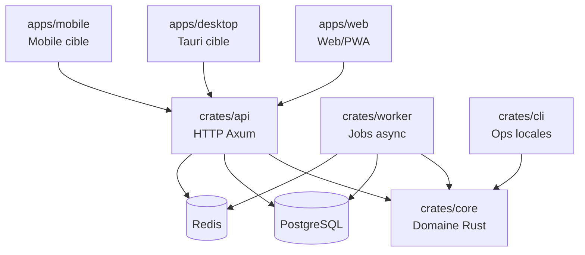

# Plan de refonte — Rust-core & multi-plateforme

## Objectif

Remettre `rumble-feed-mind` sur une trajectoire produit distribuable : un cœur Rust robuste, des adapters minces, des gates observables et des cibles web/desktop/mobile cohérentes.

## Problèmes observés

- Le workspace Rust compile, mais beaucoup de code préparatoire reste non branché.
- `clippy --all-targets -D warnings` n'est pas encore atteignable sans nettoyage.
- La distribution multi-plateforme n'est pas formalisée.
- La doctrine agentic-harness/practice n'était pas déclarée dans le repo.
- `Cargo.lock` était ignoré alors que le repo contient des binaires/applications.

## Architecture cible

## Phases

### Phase 0 — Doctrine et reproductibilité

- Ajouter `AGENTS.md` local.
- Ajouter `goals.toml`.
- Ajouter README racine.
- Versionner `Cargo.lock`.
- Supprimer les dev-dependencies cassées ou inutilisées.

### Phase 1 — Qualité Rust minimale

- Nettoyer les imports inutilisés.
- Catégoriser le dead code : API future documentée, code à brancher, code à supprimer.
- Activer progressivement `cargo clippy --workspace --all-targets --all-features -- -D warnings`.
- Ajouter des tests unitaires autour de `core` avant tout déplacement métier.

### Phase 2 — Core domain stable

- Stabiliser les modules `feed`, `opml`, `article`, `rules`, `crypto`.
- Introduire des traits de ports si nécessaire : `FeedRepository`, `ArticleRepository`, `RuleRepository`, `AiProvider`.
- Éviter que `api` ou `worker` réimplémentent des invariants.

### Phase 3 — Adapters et contrats

- Normaliser les réponses API `{ data, meta }`.
- Rendre la pagination cursor-based effective.
- Encapsuler Redis queues côté worker.
- Ajouter smoke tests API + worker avec PostgreSQL/Redis.

### Phase 4 — Distribution

- Web/PWA : stabiliser build, lint, variables publiques.
- Desktop : ajouter Tauri seulement après stabilisation API/core.
- Mobile : choisir Expo API-first ou client natif après validation des besoins offline.
- Release : préparer matrix Linux/macOS/Windows pour CLI et desktop via `gear-cable` si pertinent.

## Non-objectifs immédiats

- Pas de réécriture complète du frontend avant stabilisation du core.
- Pas d'UniFFI tant que l'offline natif n'est pas prouvé nécessaire.
- Pas de nouveau provider IA tant que BYOK/crypto/audit ne sont pas durcis.
- Pas d'hébergement US obligatoire.

## Critères d'acceptation de la refonte initiale

- `cargo fmt --all --check` vert.
- `cargo check` vert.
- `cargo test --workspace` vert ou écarts documentés.
- `cargo clippy --workspace --all-targets --all-features -- -D warnings` vert.
- README + AGENTS + goals à jour.
- ADR écrite pour tout choix de distribution structurant.
