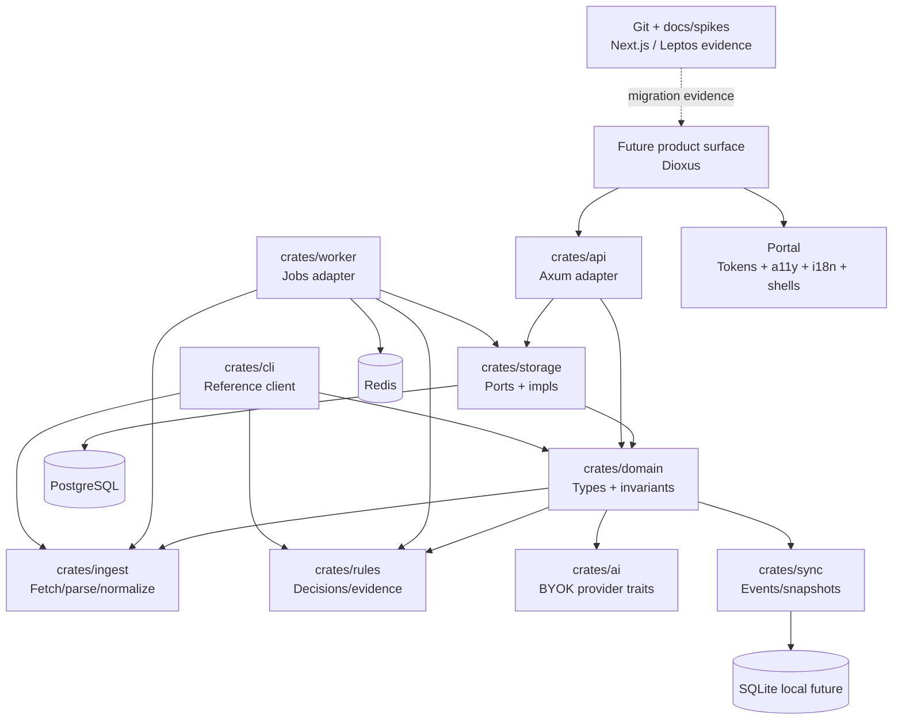

# Plan de refonte — Rust-first product stack

## Objectif

Pivoter `rumble-feed-mind` vers une stack produit Rust-first : le domaine, les règles, les contrats IA, la synchronisation, les adapters et les surfaces durables doivent converger vers Rust. Les surfaces Next.js et Leptos retirées du workspace restent des références historiques, pas des cibles durables.

## État vérifié au 2026-07-12

- Les crates `domain`, `ingest`, `rules`, `sync` et `storage` sont extraites ; API, worker et CLI ne dépendent plus de la façade `feedmind-core`.
- La CLI prouve OPML → fetch/fixture → normalisation → règle explicable → export JSON golden ; l'issue #4 est terminée.
- Le spike Leptos a été exécuté puis retiré ; son évaluation reste dans `docs/spikes/leptos-web-shell.md`.
- ADR 0002 fixe **Dioxus** comme cible durable. Le prochain jalon UI est un parcours produit Dioxus runnable après stabilisation des contrats Portal.
- Aucun shell desktop/Tauri n'est un objectif actif ; la distribution sera évaluée après la preuve Dioxus et fera l'objet d'une décision dédiée.

## Vision challengée

Mauvaise formulation : “lecteur RSS avec IA”.

Formulation cible :

> `rumble-feed-mind` est un moteur personnel de veille souveraine : il ingère, normalise, qualifie, explique et distribue l'information utile sur plusieurs plateformes.

Conséquences :

- Le produit central n'est pas l'UI.
- Le produit central n'est pas l'API.
- Le produit central n'est pas PostgreSQL.
- Le produit central est le graphe d'information + décisions explicables + sync/export.

## Restes observés

- Les contrats UI Portal ne sont pas encore matérialisés dans une surface produit Dioxus.
- La distribution multi-plateforme n'est pas encore décidée ni prouvée.
- Les événements et snapshots existent comme primitives, mais leur persistance/rejeu produit reste à compléter.
- Les parcours serveur self-hostable et l'observabilité de production restent incomplets.

## Architecture cible



## Chantiers

### Chantier 1 — Crate split domaine

- Créer `crates/domain`.
- Déplacer les types purs : feeds, articles, règles, OPML DTOs, decisions.
- Faire dépendre l'ancien `crates/core` de `domain` pendant transition.
- Aucun changement API visible.

Acceptation : gates Rust vertes.

### Chantier 2 — Event model

Modéliser les événements métier :

```text
FeedAdded
FeedFetched
ArticleDiscovered
ArticleNormalized
RuleEvaluated
DecisionExplained
ArticleRead
ArticleExported
```

Objectif : replay, audit, sync multi-device, offline futur.

### Chantier 3 — Rules engine explicable

Remplacer le modèle “regex match” par :

```rust
RuleInput -> RuleDecision {
    matched,
    actions,
    confidence,
    explanation,
    evidence,
}
```

Les actions ne doivent pas être appliquées silencieusement.

### Chantier 4 — CLI comme preuve du core

La CLI doit prouver que le produit existe sans UI web :

- importer OPML
- fetch un flux
- normaliser des articles
- évaluer des règles
- exporter un snapshot

### Chantier 5 — Storage ports

- Introduire traits `FeedStore`, `ArticleStore`, `RuleStore`, `EventStore`.
- Impl PostgreSQL côté serveur.
- Impl mémoire pour tests.
- Impl SQLite seulement quand l'offline est cadré.

### Chantier 6 — UI Rust

Trajectoire initiale conservée pour l'historique : un spike `apps/web-rs` Leptos/WASM a évalué le shell Rust, puis a été retiré après ratification Dioxus. L'évaluation demeure dans `docs/spikes/leptos-web-shell.md` ; Next.js est également archivé hors du workspace.

Trajectoire active :

- stabiliser les contrats écran et UI Portal ;
- créer une surface Dioxus runnable sur un parcours produit réel, alimenté par les contrats Rust existants et non par des données uniquement mockées ;
- documenter sa commande de build/test et son smoke reproductible ;
- étendre ensuite aux parcours critiques : feeds, articles, détail, règles et evidence.

### Chantier 7 — Distribution

- Évaluer les cibles web/native/desktop/mobile à partir de la preuve Dioxus.
- Formaliser le choix de packaging dans une décision dédiée avant de créer un shell.
- Conserver la matrice CLI Linux/macOS/Windows et ajouter des artefacts UI seulement lorsqu'une cible est retenue.

## Non-objectifs immédiats

- Pas de big bang UI.
- Pas d'effacement de l'historique Next.js/Leptos ; leurs retraits du workspace restent documentés.
- Pas de shell desktop ni de choix Tauri implicite avant preuve Dioxus et décision dédiée.
- Pas de nouveau provider IA tant que BYOK/crypto/audit ne sont pas durcis.
- Pas d'hébergement US obligatoire.

## Harness practices

- `goals.toml` suit la phase active.
- Toute décision structurante passe par ADR.
- Chaque incrément fournit une preuve : commandes, tests, diff ciblé.
- Les gates Rust restent non négociables.
- Les exceptions temporaires (`allow(dead_code)` par exemple) doivent être locales, commentées et supprimables.

## Critères d'acceptation de la refonte initiale

- `cargo fmt --all --check` vert.
- `cargo check` vert.
- `cargo test --workspace` vert.
- `cargo clippy --workspace --all-targets --all-features -- -D warnings` vert.
- `agentic-harness goals report --config goals.toml` lisible.
- ADR du pivot Rust-first acceptée.
