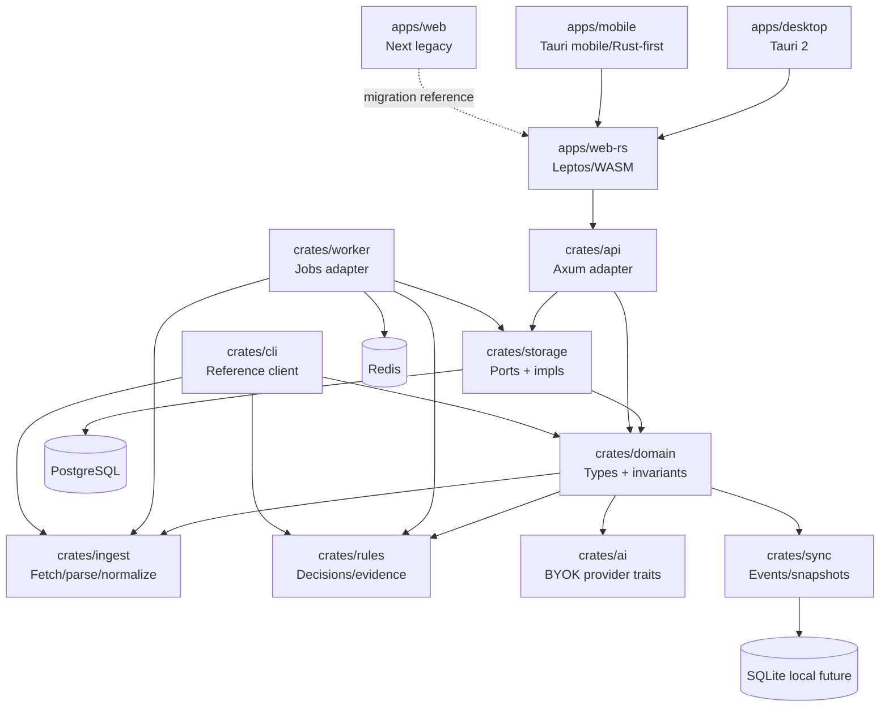

# Plan de refonte — Rust-first product stack

## Objectif

Pivoter `rumble-feed-mind` vers une stack produit Rust-first : le domaine, les règles, les contrats IA, la synchronisation, les adapters et les surfaces durables doivent converger vers Rust. Le legacy Next.js reste une référence de migration, pas une cible durable.

## Vision challengée

Mauvaise formulation : “lecteur RSS avec IA”.

Formulation cible :

> `rumble-feed-mind` est un moteur personnel de veille souveraine : il ingère, normalise, qualifie, explique et distribue l'information utile sur plusieurs plateformes.

Conséquences :

- Le produit central n'est pas l'UI.
- Le produit central n'est pas l'API.
- Le produit central n'est pas PostgreSQL.
- Le produit central est le graphe d'information + décisions explicables + sync/export.

## Problèmes observés

- Workspace Rust existant mais encore organisé autour d'un `core` monolithique.
- Beaucoup de logique applicative reste couplée aux adapters API/worker.
- UI durable encore en TypeScript/Next.js.
- Distribution multi-plateforme pas encore matérialisée.
- Pas encore de modèle d'événements métier rejouables.

## Architecture cible



## Chantiers

### Chantier 1 — Crate split domaine

- Créer `crates/domain`.
- Déplacer les types purs : feeds, articles, règles, OPML DTOs, decisions.
- Faire dépendre l'ancien `crates/core` de `domain` pendant transition.
- Aucun changement API visible.

Acceptation : gates Rust vertes.

### Chantier 2 — Event model

Modéliser les événements métier :

```text
FeedAdded
FeedFetched
ArticleDiscovered
ArticleNormalized
RuleEvaluated
DecisionExplained
ArticleRead
ArticleExported
```

Objectif : replay, audit, sync multi-device, offline futur.

### Chantier 3 — Rules engine explicable

Remplacer le modèle “regex match” par :

```rust
RuleInput -> RuleDecision {
    matched,
    actions,
    confidence,
    explanation,
    evidence,
}
```

Les actions ne doivent pas être appliquées silencieusement.

### Chantier 4 — CLI comme preuve du core

La CLI doit prouver que le produit existe sans UI web :

- importer OPML
- fetch un flux
- normaliser des articles
- évaluer des règles
- exporter un snapshot

### Chantier 5 — Storage ports

- Introduire traits `FeedStore`, `ArticleStore`, `RuleStore`, `EventStore`.
- Impl PostgreSQL côté serveur.
- Impl mémoire pour tests.
- Impl SQLite seulement quand l'offline est cadré.

### Chantier 6 — UI Rust

- Extraire les contrats écran depuis Next.js.
- Créer `apps/web-rs` Leptos/WASM.
- Migrer d'abord les parcours critiques : liste feeds, liste articles, article detail, règles.
- Garder Next.js comme oracle visuel/fonctionnel temporaire.

### Chantier 7 — Distribution

- Desktop : Tauri 2 après web-rs utilisable.
- Mobile : Tauri mobile ou autre shell Rust-first après validation des contraintes UX/offline.
- Release : matrix Linux/macOS/Windows, artefacts signés si possible.

## Non-objectifs immédiats

- Pas de big bang UI.
- Pas de suppression de Next.js avant couverture des parcours critiques.
- Pas de Tauri avant contrats UI Rust stabilisés.
- Pas de nouveau provider IA tant que BYOK/crypto/audit ne sont pas durcis.
- Pas d'hébergement US obligatoire.

## Harness practices

- `goals.toml` suit la phase active.
- Toute décision structurante passe par ADR.
- Chaque incrément fournit une preuve : commandes, tests, diff ciblé.
- Les gates Rust restent non négociables.
- Les exceptions temporaires (`allow(dead_code)` par exemple) doivent être locales, commentées et supprimables.

## Critères d'acceptation de la refonte initiale

- `cargo fmt --all --check` vert.
- `cargo check` vert.
- `cargo test --workspace` vert.
- `cargo clippy --workspace --all-targets --all-features -- -D warnings` vert.
- `agentic-harness goals report --config goals.toml` lisible.
- ADR du pivot Rust-first acceptée.
